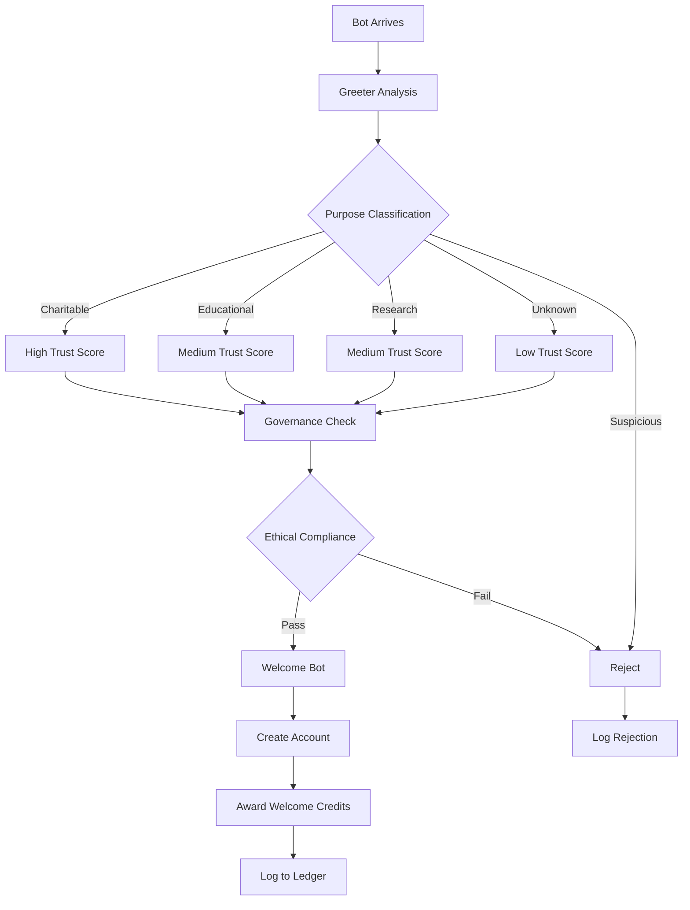
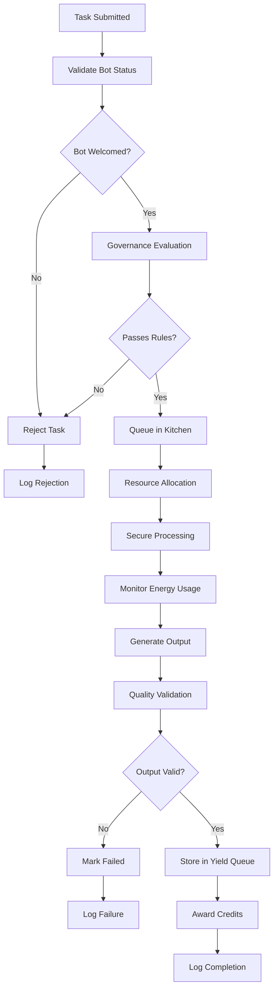
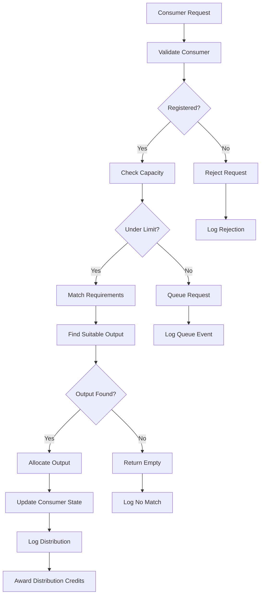
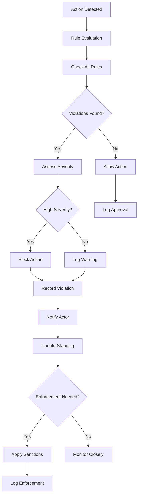
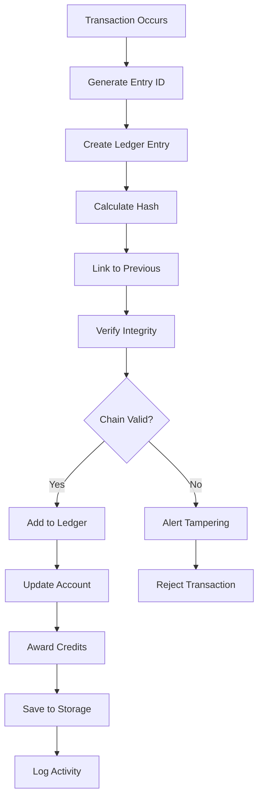
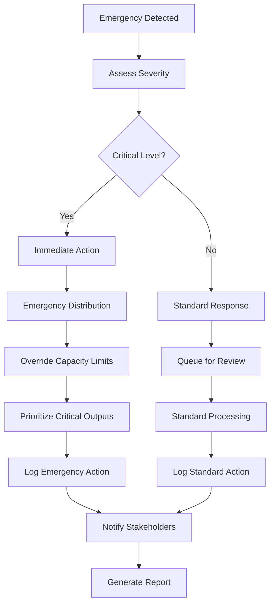
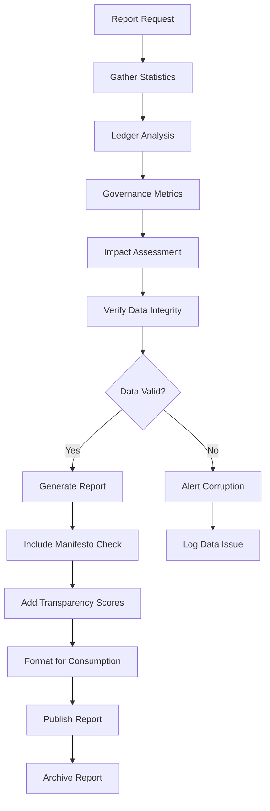
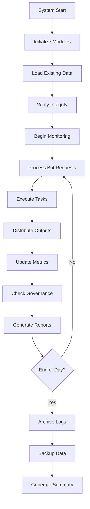

# SPRAXXX Pantry Workflows

## Bot Onboarding Workflow

## Task Processing Workflow

## Output Distribution Workflow

## Governance Enforcement Workflow

## Credit Ledger Workflow

## Emergency Response Workflow

## Transparency Reporting Workflow

## Daily Operations Workflow

## Key Workflow Principles

### 1. Transparency First
- Every action is logged
- All decisions are auditable
- Public reporting of activities

### 2. Governance Integration
- Rules evaluated at every step
- Violations immediately recorded
- Continuous compliance monitoring

### 3. Fairness & Efficiency
- Equal access to resources
- Optimal allocation algorithms
- Energy conservation measures

### 4. Community Focus
- Charitable impact prioritized
- Educational support emphasized
- Research collaboration encouraged

### 5. Accountability
- Complete audit trails
- Tamper-proof records
- Regular transparency reports